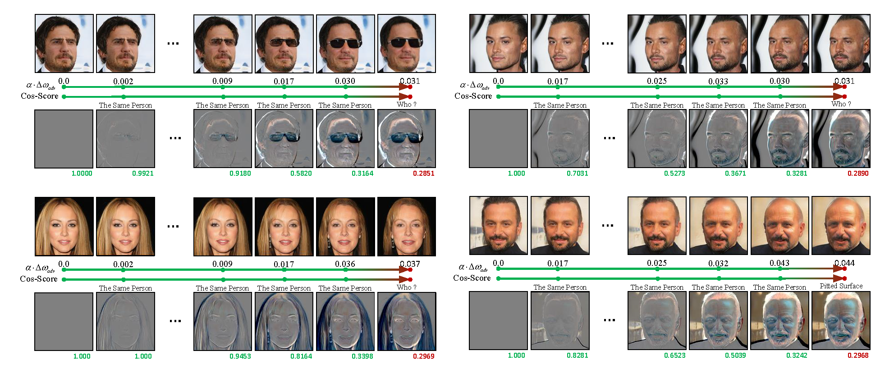

# A Semantic Controllable Adversarial example Generation Method Based on Disentangled Representation

 

## Abstract (Article Status: Under Preview):
A novel Semantic Controlled Adversarial Example Generation method (SCAEG) is presented that enables precise control of structured semantic perturbations on the semantic manifold for more realistic and interpretable adversarial attacks. The SCAEG contains a deep generative model architecture that enables disentangled representation of images to extract and edit semantically relevant high-level attributes, facilitating transformations like object shape deviations or facial appearance changes. By incorporating generalized adversarial attack vectors into these attributes, the SCAEG perturbs target classifiers while maintaining valid semantics. An Adversarial Increment Module is designed to generate these vectors, guiding the semantic manifold toward the model's decision boundary. This approach also allows precise control over the size and direction of perturbations, ensuring smooth transitions from normal to adversarial examples that align with human visual perception. The SCAEG enhances the stealthiness and effectiveness of adversarial examples and provides new insights into the vulnerabilities of deep neural networks.

## Description
This repo includes the official Pytorch implementation of **Our Method (SCAEG)**.

- **Our Method** allows user to realize smooth transitions from `normal` to `adversarial examples` that align with human visual perception, through powerful generative models, such as StyleGAN.
 

 

## Usage

The training and testing experiments are conducted using with a single NVIDIA RTX A6000 (48 GB).
The memory can be provisioned according to the size of the generated model and the size of the dataset.
1. Prerequisites:
    + Creating a virtual environment in terminal: `conda create -n SCAEG python=3.7`.
    + Installing necessary packages: `pip install -r requirements.txt`.
2. Prepare custom dataset
    + downloading your dataset and putting it into `./dataset`.
    + editing code class of `CustomDataset`, `CustomDataloader`, and `CustomDatamodule` in `DataM.py`.
3. Prepare several well-trained depp-learning models:
   + downloading your task models to be attacked and put them into `Models`.
4. Prepare decoupling process
   + obtaining pre-trained generative and discriminative structures from `stylegan2adapytorch`.
   + running the reconstruction stage through executing `--python train.py` (under terminal: `Training`). 
5. Prepare adversarial process
   + obtaining pre-trained generative and discriminative structures from `the decoupling process`.
   + running the reconstruction stage through executing `--python train.py` (under terminal: `TrainingADV`). 
